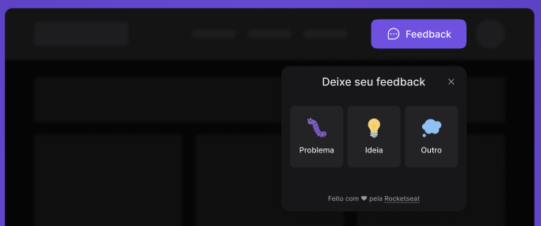

<h1 align="center">
    
</h1>

# Feedback-Web-Application-

### 🧭 Rodar aplicação

```bash
# Clone este repositório
$ git clone https://github.com/fristtram/Feedback-Web-Application-

# Acesse a pasta do projeto no seu terminal/cmd
$ cd Feedback-Web-Application-

# Instale as dependências
$ npm install

# Execute a aplicação em modo de desenvolvimento
$ npm run dev

# A aplicação será aberta na porta:3000 - acesse http://localhost:3000
```

## 🛠 Tecnologias

As seguintes ferramentas foram usadas na construção deste projeto:

- [Vite][Vite] - Criar o projeto da melhor forma
- [Tailwind CSS][TailwindCSS] - Uma experiência incrivel com CSS [Essa coisa faz milagre]
- [Phosphor][Phosphor] - Icones
- [Headlessui][Headlessui] - Trabalhar a acessibilidade


🚧 Em construção... 🚧

## 😯 Como contribuir para o projeto

1. Faça um **fork** do projeto.
2. Crie uma nova branch com as suas alterações: `git checkout -b my-feature`
3. Salve as alterações e crie uma mensagem de commit contando o que você fez: `git commit -m "feature: My new feature"`
4. Envie as suas alterações: `git push origin my-feature`

[Vite]: https://vitejs.dev/blog/announcing-vite2.html
[TailwindCSS]: https://tailwindcss.com/docs/installation
[Phosphor]: https://phosphoricons.com/
[Headlessui]: https://headlessui.dev/